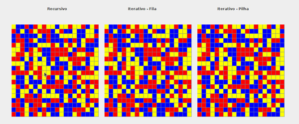
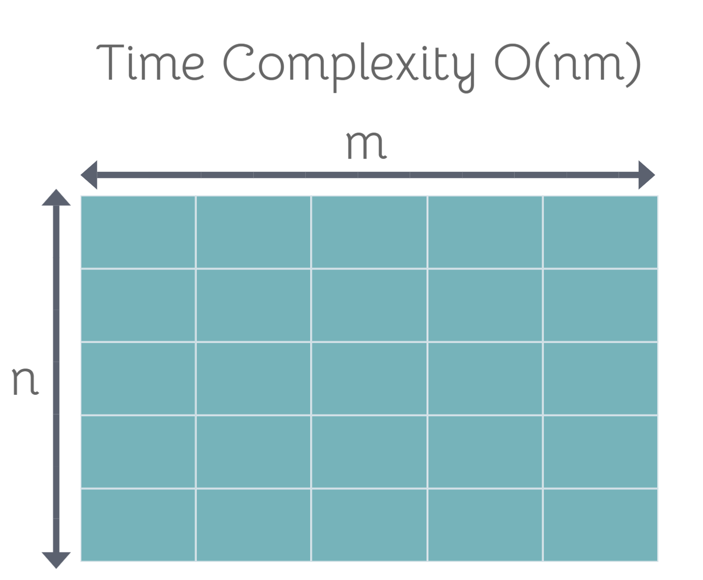

# Flood-fill

*Flood fill* ou *Seed Fill* é um **Algoritmo de Inundação** usado para determinar ou preencher uma área limitada conectada a uma determinada célula/nó em uma matriz/grafo.

O nome é dado à sua característica similar ao de uma inundação, a qual preenche todos os espaços disponíveis dentro de 
uma área limitada por alguma fronteira. O algoritmo é simples, porém robusto pois funciona bem em geometrias irregulares 
e complexas identificando pontos conectados a uma determinada fonte até o seu limite. Além disso, pode ser trivialmente generalizado para
uma estrutura em grafo. Existe também a possibilidade de aplicar a lógica à outra funcionalidade inversa, a de encontrar
a fronteira, ou seja, os pontos conectados que cercam uma determinada área. Essa variante é chamada **boundary fill**.


## Aplicações
<!-- Comentário: aqui cada um pode explicar cada aplicação --> 

### Rede de computadores

É usado para distribuir informação para todos os nós de uma rede conectada

<p align="center">

</p>

### Matemática 

É usado para resolver vários problemas, inclusive problemas de labirinto e os envolvidos com a teoria de grafos. 

<p align="center">

</p>

### Computação Gŕafica

É usado para preencher toda uma área delimitada por uma cor com uma outra cor, a partir de um ponto inicial. 

Esse é o algoritmo normalmente usado para a ferramenta "paint bucket" nos editores de imagem.

<p align="center">

</p>

## Algoritmo

```
1. Pegue a posição do ponto de partida.
2. Decida se quer ir em 4 direções (N, S, W, E) ou 8 direções (N, S, W, E, NW, NE, SW, SE).
3. Escolha uma cor/número de substituição e de alvo.
4. Viaje nessas direções.
5. Se a cor/número em que você cair for um alvo, troque pela cor/número de substituição.
6. Repita 4 e 5 até que você esteja em todos os lugares dentro dos limites.
```

## Implementações
<!-- Comentário: já que tenho parte do código, vou tentar implementar cada um e gerar GIFs próprios. Talvez a gente tenha que deixar o Span Filling de fora --> 

### Recursive 4-way

```
Flood-fill (node):
 1. If node is not Inside return.
 2. Set the node.
 3. Perform Flood-fill one step to the east of node.
 4. Perform Flood-fill one step to the west of node.
 5. Perform Flood-fill one step to the north of node.
 6. Perform Flood-fill one step to the south of node.
 7. Return.
```

### Iterative 4-way - Queue or Stack

```
Flood-fill (node):
  1. Set Q to the empty queue or stack.
  2. Add node to the end of Q.
  3. While Q is not empty:
  4.   Set n equal to the first element of Q.
  5.   Remove first element from Q.
  6.   If n is Inside:
         Set the n
         Add the node to the east of n to the end of Q.
         Add the node to the west of n to the end of Q.
         Add the node to the north of n to the end of Q.
         Add the node to the south of n to the end of Q.
  7. Continue looping until Q is exhausted.
  8. Return.
```
<p align="center">

</p>

### Complexidade

<p align="center">

</p>


### Conclusão

É um algoritmo simples de implementar e com várias utilidades. Porém, a solução em Fila ou Pilha pode utilizar muita memória e alguns pixels podem ser visitados muitas vezes.

## Referências

- [https://pt.wikipedia.org/wiki/Algoritmo_de_inunda%C3%A7%C3%A3o](https://pt.wikipedia.org/wiki/Algoritmo_de_inunda%C3%A7%C3%A3o)
- [https://www.freecodecamp.org/news/flood-fill-algorithm-explained/](https://www.freecodecamp.org/news/flood-fill-algorithm-explained/)
- [https://www.thecshandbook.com/Flood_Fill](https://www.thecshandbook.com/Flood_Fill)
- [https://en.wikipedia.org/wiki/Flood_fill](https://en.wikipedia.org/wiki/Flood_fill)
